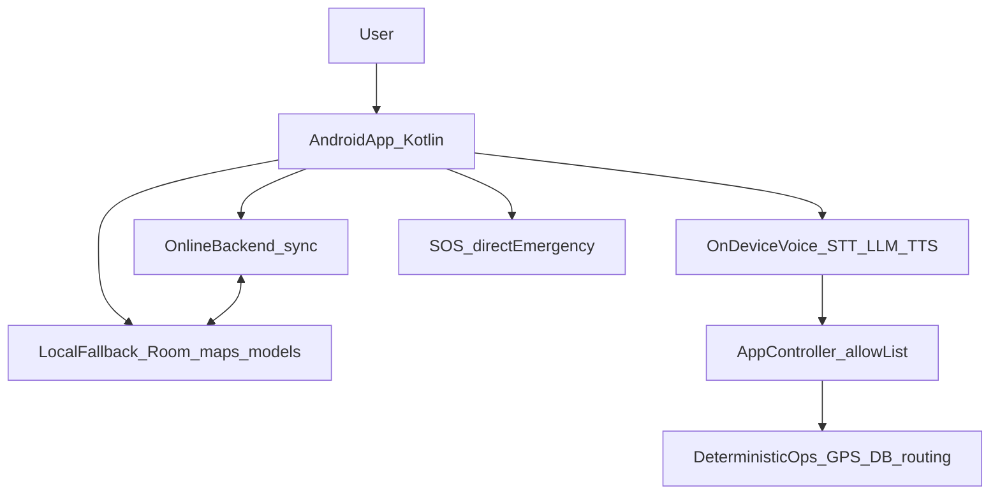

# VariMitra

Online-first, offline-fallback, voice-first companion for the Wari / Pandharpur pilgrimage.

VariMitra helps pilgrims — especially elderly and digitally inexperienced users — find nearby essentials, understand where the Wari is scheduled to be, reconnect families, and reach emergency help. It uses the internet when available and automatically falls back to local data and on-device AI when connectivity is lost.

**Languages:** Marathi, Hindi, English  
**Client:** Native Android / Kotlin (separate Android Studio project)  
**Product definition:** PRD v3.0 (29 August 2026)

---

## Product overview

- **Nearby essential facilities** — water, food, medical, toilet, accommodation, transport, and women's needs (verified women's toilets, sanitary-pad availability, help points, and related support where available).
- **Wari intelligence** — routes, dates, timings, daily halts (मुक्काम), and expected location for a selected date and time. Scheduled position is never labeled as live unless a valid live source exists.
- **Voice assistant** — push-to-talk, not always-listening. Marathi, Hindi, and English.
- **Family Link and Lost & Found** — optional one-time QR / short-code pairing. Normal app use requires no login.
- **Emergency SOS** — large home-screen control with a 5-second cancel window. SOS never goes through STT, LLM, or TTS.

---

## Principles

- Online when available; resilient when unavailable. The user does not switch modes manually.
- Voice-first, but never voice-only.
- The LLM interprets language. Deterministic application code executes actions.
- Facility and Wari facts come from structured data, not from model weights.
- Unknown information is stated as unknown. The system must not guess.
- SOS is outside the AI pipeline and does not depend on the cloud to start a local emergency action.

---

## Architecture



**On-device voice path**

Push-to-talk → IndicWhisper (whisper.cpp) → small on-device LLM → App Controller → deterministic app function → Indic-TTS.

The App Controller validates every LLM output against a hardcoded allow-list. Malformed actions are rejected. Arbitrary model text is never executed.

**Online layer** (this repository, after TRD)

Fresh facilities, Wari schedule updates, synchronization, and family / lost-and-found communication when connectivity exists.

**Local fallback** (on the phone)

SQLite / Room, cached facilities and Wari schedule, offline maps and routes, and on-device model assets. If the network disappears, the last successful cache remains the source of truth.

**Wari location truth model**

| State | Meaning |
| --- | --- |
| `SCHEDULED` | Derived from the approved date/time schedule; say expected / scheduled |
| `LIVE` | Current or near-live position from a valid source |
| `LAST_KNOWN` | Previously synchronized position; not current |
| `UNKNOWN` | No reliable data for the requested date/time |

---

## Action contract

The LLM may emit only these actions. SOS is **not** an LLM action.

| Action | Parameters | Executor |
| --- | --- | --- |
| `OPEN_SECTION` | Facility category | Deterministic app |
| `CLOSE_SECTION` | Current section | Deterministic app |
| `GO_BACK` | None | Deterministic app |
| `FIND_NEAREST` | Facility category | GPS + local DB |
| `SHOW_ROUTE` | Selected destination | Routing layer |
| `GET_DISTANCE` | Selected location | Deterministic calculation |
| `SELECT_LOCATION` | Location identifier | Deterministic app |
| `READ_INFORMATION` | Known local info key | Local data |
| `GENERAL_QUESTION` | Free text | Short LLM generation |
| `STOP` | None | Voice controller |
| `GET_WARI_STATUS` | Date, time, optional palkhi | Wari schedule function |
| `LOST_PERSON_REPORT` | Description, location, optional family link | Lost & Found |
| `FAMILY_STATUS` | Family-link context | Family service |

Three-stage decision path: direct matching for obvious commands (bypass LLM) → intent classification into a structured action → short generation only for `GENERAL_QUESTION`.

---

## This repository

This repo is the **backend and LLM workspace**. The Android UI/UX is built separately in Android Studio and is out of scope here.

| Area | Responsibility |
| --- | --- |
| Backend / API | Online sync: facilities, Wari updates, Family Link, Lost & Found queue |
| LLM | Model selection, fine-tuning / export, action-schema contract, evaluation |

Planned layout (not created yet except this README):

```text
docs/       PRD notes; later TRD and database schema
backend/    Online sync API (after TRD)
llm/        Training, eval, GGUF export, action-schema contract
```

The Android app owns on-device STT, the on-device LLM runtime, TTS, Room cache, maps, SOS, and UI. This repo will supply the online API the app syncs with, plus the LLM artifacts and action contract the on-device model must follow.

---

## Status

**Current phase:** documentation.

| Item | Status |
| --- | --- |
| Product definition (PRD v3.0) | Available |
| Technical requirements (TRD) | To be added |
| Database schema | To be added |
| Backend stack, API surface, setup commands | To be defined from TRD / schema |
| On-device model choice (1B–3B instruct, GGUF Q4_K_M baseline) | To be benchmarked; not locked yet |

After the TRD and schema arrive, this README will lock backend stack, API surface, and local-versus-server data ownership.

---

## MVP vs later

**MVP**

- Nearby essential facilities, including women's-needs category
- Offline-capable maps and routes
- Wari routes, dates, timings, halts, and expected location
- Marathi / Hindi / English voice assistant
- Online fresh data with automatic offline fallback
- Family Link and basic Lost & Found synchronization
- Emergency SOS

**Later (not promised in MVP)**

- Bluetooth / Wi-Fi Direct lost-person mesh
- Large-scale live crowd-density intelligence
- Advanced live Wari tracking from an authorized feed
- Deep police / control-room integration and volunteer dispatch
