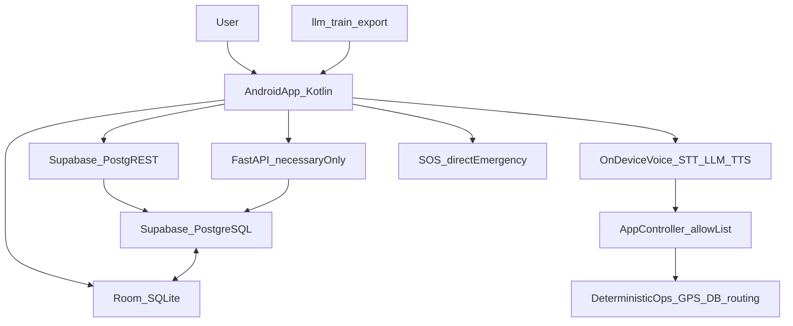

# VariMitra

Online-first, offline-resilient, voice-first companion for the Wari / Pandharpur pilgrimage.

VariMitra helps pilgrims — especially elderly and digitally inexperienced users — find nearby essentials, understand where the Wari is scheduled to be, reconnect families, and reach emergency help. It uses the internet when available and automatically falls back to local data and on-device AI when connectivity is lost. The user never switches modes manually.

**Languages:** Marathi, Hindi, English  
**Client:** Native Android / Kotlin (separate Android Studio project)  
**Product definition:** PRD v3.0 (29 August 2026)  
**Technical requirements:** TRD v2.0 (replaces TRD1; synchronized with PRD v3.0)  
**Online data model:** Database Design v3.0 (Supabase PostgreSQL + Room mirror)

---

## Product overview

- **Nearby essential facilities** — water, food, medical, toilet, accommodation, transport, and WOMEN (verified women's toilets, sanitary-pad availability, help points, medical/welfare support, changing/rest or child-care where available). Schema also allows `police`, `rest_area`, and `charging`.
- **Wari intelligence** — routes, dates, timings, daily halts (मुक्काम), and expected location for a selected date and time. Scheduled position is never labeled as live unless a valid live source exists.
- **Voice assistant** — push-to-talk, not always-listening. Marathi, Hindi, and English.
- **Family Link and Lost & Found** — optional one-time QR / short-code pairing. Normal app use requires no login.
- **Emergency SOS** — large home-screen control with a 5-second cancel window. SOS never goes through STT, LLM, TTS, or the cloud to start a local emergency action.

---

## Principles

- Online when available; resilient when unavailable. No manual offline-mode toggle.
- Voice-first, but never voice-only.
- The LLM interprets language. Deterministic application code executes actions.
- Facility, Wari, and family facts live in SQLite/Room and the backend, never in model weights.
- Unknown information is stated as unknown. The system must not guess.
- SOS bypasses STT, LLM, and TTS.
- A scheduled Wari position must never be presented as a live position.

---

## Architecture



**On-device voice path** (TRD v2.0; same pipeline as v1)

Push-to-talk → IndicWhisper (`whisper.cpp`) → small on-device LLM (`llama.cpp`) → App Controller → deterministic app function → Indic-TTS.

The App Controller validates every LLM output against a hardcoded allow-list. Malformed actions are rejected. Arbitrary model text is never executed. Voice inference has no runtime network requirement.

**Online layer** (this repository)

Supabase PostgreSQL is the shared store. Simple catalog reads may use PostgREST. FastAPI is used where PostgREST is not enough: Family Link pairing (hashes only), batch catalog sync, queued Lost & Found / SOS ingest with `server_received_at`, and family status. The sync API must never sit on the critical path of the voice pipeline or of a local SOS call.

**Local fallback** (on the phone)

Room / SQLite is the source of truth while offline. Offline maps, routing assets, and STT / LLM / TTS models are app files, not database rows. If the network disappears, the last successful local copy remains usable.

**Wari location truth model**

| State | Meaning |
| --- | --- |
| `SCHEDULED` | Derived from the approved date/time schedule; say expected / scheduled |
| `LIVE` | Current or near-live position from a valid source |
| `LAST_KNOWN` | Previously synchronized position; not current |
| `UNKNOWN` | No reliable data for the requested date/time |

The API and UI must not relabel `scheduled` as `live`.

---

## Locked stack

| Layer | Technology | Owner |
| --- | --- | --- |
| Android app | Kotlin, native Android | Separate Android Studio project |
| Local runtime DB | SQLite via Room | Android |
| Online database | Supabase PostgreSQL | This repo |
| Necessary API | FastAPI (`backend/api`) for pairing, batch sync, queue ingest | This repo |
| Optional simple reads | Supabase PostgREST | Android may use later |
| Sync | Room first, remote second; queued writes on reconnect | Android + this repo |
| Maps | OSMdroid + offline OSM extracts for the Wari corridor | Android |
| Offline routing | Bundled GraphHopper where needed | Android |
| STT | AI4Bharat IndicWhisper via `whisper.cpp` (NDK / JNI), 16 kHz mono PCM | Android |
| Intent LLM | 1B–3B open-weight instruct model, GGUF `Q4_K_M`, `llama.cpp` + JNI | Android runtime; this repo trains / exports |
| Fine-tuning | LoRA / QLoRA via Unsloth or PEFT | This repo (`llm/`) |
| TTS | AI4Bharat Indic-TTS, on-device, short confirmations | Android |

Benchmark candidates (not locked): **Qwen 3 1.7B**, **Llama 3.2 3B**, **Gemma 3 1B**. Higher quantizations (Q5 / Q6) only if the target device has 8 GB+ RAM. Benchmark on real hardware, not only an emulator.

TRD v1 assumed a fully offline runtime with no network component. TRD v2.0 keeps that voice pipeline as the fallback and adds the online freshness/sync layer. Core voice inference still runs on-device with no network requirement.

---

## Action contract

The LLM may emit only these actions. This allow-list is **official in TRD v2.0**. SOS is **not** an LLM action and does not go through the App Controller.

| Action | Parameters | Executor |
| --- | --- | --- |
| `OPEN_SECTION` | Facility category | Deterministic app |
| `CLOSE_SECTION` | Current section | Deterministic app |
| `GO_BACK` | None | Deterministic app |
| `FIND_NEAREST` | Facility category | GPS + local DB |
| `SHOW_ROUTE` | Selected destination | Routing layer |
| `GET_DISTANCE` | Selected location | Deterministic calculation |
| `SELECT_LOCATION` | Location identifier | Deterministic app |
| `READ_INFORMATION` | Known local info key | Local data |
| `GENERAL_QUESTION` | Free text | Short LLM generation |
| `STOP` | None | Voice controller |
| `GET_WARI_STATUS` | Date, time, optional palkhi | Wari schedule function |
| `LOST_PERSON_REPORT` | Description, location, optional family link | Lost & Found |
| `FAMILY_STATUS` | Family-link context | Family service |

Facility categories for `OPEN_SECTION` / `FIND_NEAREST`: `WATER`, `FOOD`, `MEDICAL`, `TOILET`, `ACCOMMODATION`, `TRANSPORT`, `WOMEN`.

Frozen machine-readable contract: [`llm/schemas/action.schema.json`](llm/schemas/action.schema.json).

Three-stage decision path: direct matching for obvious commands (bypass LLM) → intent classification into a structured action → short generation only for `GENERAL_QUESTION`. Output is strict JSON except that free-form text is allowed only for `GENERAL_QUESTION`. Uncertain or malformed output asks for clarification; it must not guess.

---

## Local vs server data ownership

| Data | Server (Supabase) | Phone (Room / files) | Offline rule |
| --- | --- | --- | --- |
| Facilities, updates | Shared source of truth | Mirrored cache | Use last cache |
| Wari palkhis, routes, schedule, major dates | Shared source of truth | Mirrored cache | Use last synced schedule |
| Local information, emergency contacts | Shared source of truth | Mirrored cache | Use local copy |
| Family links, lost-person reports | Shared when synced | Local row + queue | Queue until reconnect; UI must say queued, not sent |
| SOS alerts | Secondary record / notify family | Local row; emergency action is native | Local call must not wait on the cloud |
| Food / water requests and distribution | P2; server optional | Not required for MVP | — |
| Facility reports | P2 | Optional local queue | — |
| Sync events | Server audit / queue representation | Local `SyncQueueEntity` | Retry with client UUID + `client_created_at` |
| Map tiles, route geometry files | Not stored as rows | Local files / cache | Prepared corridor, not all of Maharashtra |
| STT / LLM / TTS models | Not stored as rows | App / model assets | Always on-device at runtime |

UUIDs are stable across online and offline writes so retries stay idempotent. Pairing codes and QR tokens are stored as hashes, not plaintext. Production Supabase uses Row Level Security; sensitive writes go through FastAPI with the service role.

The local Room database is not a UI convenience cache. It is what keeps core assistance working when connectivity disappears.

---

## API surface

Documented contract for the Android app: **FastAPI** ([`backend/api`](backend/api)). Simple catalog reads may also use Supabase PostgREST later.

| Method | Path | Purpose |
| --- | --- | --- |
| `GET` | `/health` | Deploy check |
| `GET` | `/sync/catalog?since=` | One pull of facilities, Wari, local info, emergency contacts |
| `POST` | `/sync/queue` | Idempotent UUID writes (lost reports, SOS records, facility reports); sets `server_received_at` |
| `POST` | `/family/pair/start` | Create short code / QR token; store hashes only |
| `POST` | `/family/pair/complete` | Redeem code on the pilgrim device; activate `family_links` |
| `GET` | `/family/status` | Last-known / queued family status for a link |

Every catalog record includes `source` and `last_updated`. Wari `position_status` is passed through unchanged. SOS ingest never places the emergency call.

Schema and policies:

- [`backend/supabase/VariMitra_Database_v3.0.sql`](backend/supabase/VariMitra_Database_v3.0.sql)
- [`backend/supabase/rls.sql`](backend/supabase/rls.sql)
- [`backend/supabase/seed.sql`](backend/supabase/seed.sql) — demo corridor only; `source = seed`; never live

---

## This repository

This repo is the **backend and LLM workspace**. The Android UI/UX is built separately in Android Studio and is out of scope here.

| Area | Responsibility |
| --- | --- |
| Backend | Supabase schema, RLS, seed data, FastAPI sync/pairing contract |
| LLM | Frozen action schema, intent dataset (mr / hi / en), eval; later LoRA / QLoRA and GGUF export |

Layout:

```text
backend/supabase/   PostgreSQL schema, RLS, demo seed
backend/api/        FastAPI (pairing, catalog sync, queue)
llm/schemas/         Frozen action JSON Schema
llm/data/intents/    Starter mr/hi/en intent dataset
llm/eval/            Allow-list validator
```

The Android app owns on-device STT, the on-device LLM runtime, TTS, Room, maps, SOS, and UI. This repo supplies the online schema/API the app syncs with, plus the LLM artifacts and action contract the on-device model must follow.

**Recommended order** (TRD v2.0, this repo):

1. Apply schema, RLS, and seed.
2. Run FastAPI against local Postgres or Supabase.
3. Keep [`llm/schemas/action.schema.json`](llm/schemas/action.schema.json) frozen.
4. Grow the intent dataset and eval harness.
5. Fine-tune later (Colab/Kaggle), export GGUF `Q4_K_M`, hand the artifact to Android.

Do not start fine-tuning before the action schema is frozen. Do not put facility or Wari facts into model weights.

### Local backend

```text
cd backend
docker compose up -d
cd api
python -m venv .venv
.venv\Scripts\activate
pip install -r requirements.txt
copy .env.example .env
uvicorn app.main:app --reload --app-dir .
```

Point `DATABASE_URL` at the Compose Postgres instance or at a Supabase connection string. Do not commit real keys.

---

## Status

**Current phase:** TRD v2.0 aligned; schema, RLS, seed, FastAPI sync/pairing, and LLM action contract landed. Fine-tuning and a live Supabase project are next.

| Item | Status |
| --- | --- |
| Product definition (PRD v3.0) | Available |
| Technical requirements (TRD v2.0) | Source of truth for this repo |
| Database design v3.0 + SQL | [`backend/supabase/VariMitra_Database_v3.0.sql`](backend/supabase/VariMitra_Database_v3.0.sql) |
| Backend database | Locked: Supabase PostgreSQL |
| Necessary API | FastAPI for pairing, batch sync, queue ingest |
| Local vs server ownership | Locked in this README |
| Setup / project keys | Local Compose or your Supabase URL; no secrets in git |
| On-device model choice | Benchmark Qwen 3 1.7B, Llama 3.2 3B, Gemma 3 1B |
| Row Level Security | [`backend/supabase/rls.sql`](backend/supabase/rls.sql) |
| Action schema | Frozen in [`llm/schemas/action.schema.json`](llm/schemas/action.schema.json) |

---

## MVP vs later

**MVP (P0 / P1)**

- Nearby essential facilities, including WOMEN
- Offline-capable maps and routes for a prepared Wari corridor
- Wari routes, dates, timings, halts, and expected location (`SCHEDULED` / `LIVE` / `LAST_KNOWN` / `UNKNOWN`)
- Marathi / Hindi / English voice assistant
- Online fresh data with automatic offline fallback
- Family Link and basic Lost & Found synchronization
- Emergency SOS (5-second cancel; local action first)

**Later (P2 / not promised in MVP)**

- Food / water request and distribution network
- Facility reporting / admin moderation
- Bluetooth / Wi-Fi Direct lost-person mesh
- Large-scale live crowd-density intelligence
- Live Wari tracking from an authorized feed
- Deep police / control-room integration and volunteer dispatch

The LLM must never directly perform GPS, routing, distance math, synchronization, or arbitrary device control.

---

## Source boundary

- **TRD v2.0** owns the full technical surface: voice pipeline, action allow-list (including Wari and Lost & Found), App Controller, Room, OSMdroid, Indic-TTS, adaptive cache, online sync, Family Link, SOS isolation, fine-tuning workflow, and build order.
- **PRD v3.0** is the product definition TRD v2.0 is synchronized with.
- **Database Design v3.0** owns the PostgreSQL / Room table model. Supabase remains the store.
- **This repo** implements the online database, RLS, FastAPI-where-necessary, and the LLM training/export side so the Android app can stay Room-first and voice-offline.
